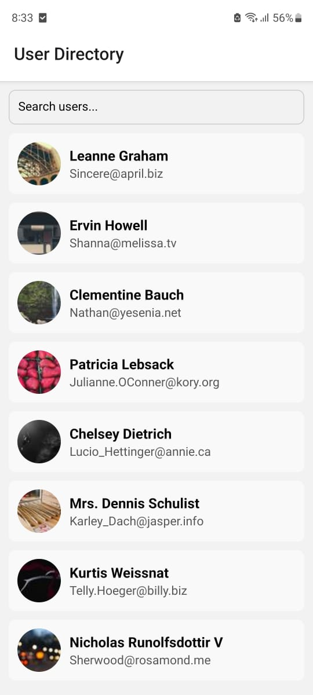
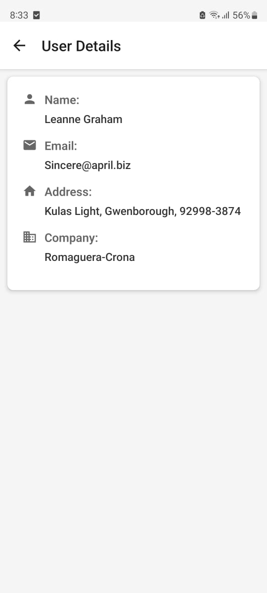

Here is the **README** for your **User Directory** app without the Markdown formatting:

---

# User Directory App

## Overview

The **User Directory** app fetches and displays a list of users from the **JSONPlaceholder API**. The app showcases each user's name and email on the list screen. Upon tapping a user entry, the app navigates to a detailed screen showing additional information about the user such as address, company, and more.

This app demonstrates React Native capabilities such as API integration, navigation, state management, and clean UI/UX design principles.

---

## Features

- **User List Screen**: Displays a list of users with their names and emails.
- **User Details Screen**: On tapping a user, a detailed view is shown with additional user information, including their address, company, and more.
- **Infinite Scrolling**: The user list supports infinite scrolling, dynamically fetching more users as the user scrolls down.
- **Responsive Layout**: The app is designed to work on both small and large screens.
- **Error Handling & Loading States**: Displays error messages if the API fails and loading indicators while data is being fetched.
- **Smooth Navigation**: Uses React Navigation for seamless transitions between the user list and details screen.

---

## Screenshots

*Example of the User List Screen*
  


*Example of the User Details Screen*
  
---

## Tech Stack

- **React Native**: Framework for building the app.
- **React Navigation**: Library used for navigating between screens.
- **Axios**: Used for fetching data from the JSONPlaceholder API.
- **React Native Paper**: For UI components (optional if you decide to include).
- **React Hooks (useState, useEffect)**: Used for state management and data fetching.

---

## Setup Instructions

### Prerequisites

Make sure you have the following installed:

- **Node.js** (v12 or higher)
- **React Native CLI** or **Expo CLI**
- **Android Studio** or **Xcode** for emulating the app

### 1. Clone the Repository

Clone the repository to your local machine using Git:

```
git clone https://github.com/your-username/user-directory-app.git
cd user-directory-app
```

### 2. Install Dependencies

Run the following command to install the required packages:

```
npm install
```

### 3. Run the App

#### For Android:

Make sure your Android emulator is running, then run:

```
npx react-native run-android
```
```
4. Start Metro Bundler

If the app does not automatically start, you can manually start the Metro bundler with:

npx react-native start

```


### How It Works


- The app fetches the list of users from the JSONPlaceholder API using `axios`.
- The list of users is displayed using the `FlatList` component with support for infinite scrolling. As the user scrolls down, additional users are fetched.


### User Details Screen

- When a user taps on an entry from the list, they are navigated to the **User Details** screen.
- The screen displays detailed information such as the user's name, email, address, and company.


## Error Handling and Loading States

- **Loading State**: A loading spinner is displayed while the data is being fetched from the API.
- **Error Handling**: If the API request fails or if there is no data, an error message is shown to the user.